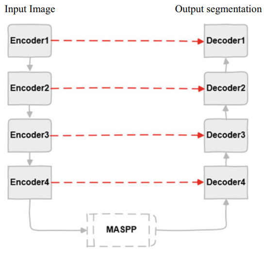
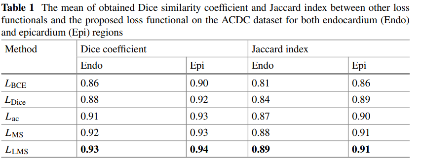
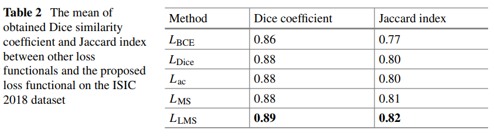

# A Deep Learning-Based Approach with Image-Driven Active Contour Loss for Medical Image Segmentation
## Introduction
This repository contains the implementation for automated endocardium (Endo) and epicardium (Epi) segmentation on the [ACDC-2017](https://www.creatis.insa-lyon.fr/Challenge/acdc/index.html) dataset and Skin lesion segmentation on the [ISIC-2018 dataset](https://challenge.isic-archive.com/landing/2018/45/) introduced in the following paper: "A Deep Learning-Based Approach with Image-Driven Active Contour Loss for Medical Image Segmentation" [https://doi.org/10.1007/978-981-16-5120-5_1](https://doi.org/10.1007/978-981-16-5120-5_1).
## Our contributions
* Introducing a new loss function based on level set method.
* Building the end-to-end model for multiphase segmentation based on U-Net architecture

## Results


## Citation
If you find this reference implementation useful in your research, please consider citing:
```
@inproceedings{trinh2022deep,
  title={A Deep Learning-Based Approach with Image-Driven Active Contour Loss for Medical Image Segmentation},
  author={Trinh, Minh-Nhat and Nguyen, Nhu-Toan and Tran, Thi-Thao and Pham, Van-Truong},
  booktitle={Proceedings of International Conference on Data Science and Applications},
  pages={1--12},
  year={2022},
  organization={Springer}
}
```

